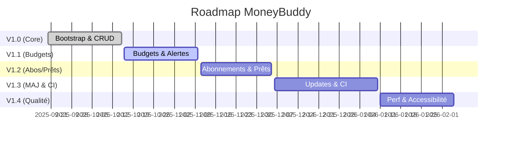

# Roadmap – MoneyBuddy

## Vision
Gérer ses finances **mois par mois**, épargner sereinement et garder une vue claire des dépenses : entrées/sorties, abonnements, prêts, budgets, rapports et rappels.

## Principes
- **Branche par feature/fix** (`feat/...`, `fix/...`) ; Conventional Commits.
- **SemVer** : `MAJOR.MINOR.PATCH`. Un `feat:` → bump **mineur**, `fix:` → bump **patch**.
- **CI** : tag `vX.Y.Z` → build Release (Android AAB signé, Windows MSIX) + GitHub Release.

---

## V1.0 — Core finance *(Milestone: v1.0)*
- [ ] feat: bootstrap MAUI (workloads, styles, DI, Shell) *(#01)*
- [ ] feat: modèles & SQLite (seed catégories, settings) *(#02)*
- [ ] feat: navigation Shell (tabs + routes) *(#03)*
- [ ] feat: transactions CRUD + filtres + recherche *(#04)*
- [ ] feat: catégories (picker + couleurs + type) *(#05)*
- [ ] feat: quick add sheet (ajout en 3 taps + deep‑link) *(#06)*
- [ ] feat: dashboard KPI (épargne, reste à vivre, revenus/dépenses) *(#07)*

**Livrables V1.0** : APK/AAB Debug, MSIX Debug, premières captures, README rapide.

---

## V1.1 — Budgets & alertes *(Milestone: v1.1)*
- [ ] feat: budgets par catégorie (progress bars, seuils 60/80/100%) *(#10)*
- [ ] feat: alertes contextuelles (budget à risque, aucune saisie 3j) *(#11)*
- [ ] feat: rapports mensuels (donut catégories, tendance 3/6/12 mois) *(#12)*

**Livrables V1.1** : export CSV de base, page Rapports.

---

## V1.2 — Abonnements & prêts *(Milestone: v1.2)*
- [ ] feat: abonnements (récurrence, `NextDueDate`, auto‑post) *(#20)*
- [ ] feat: prêts (échéancier, restant dû) *(#21)*
- [ ] feat: notifications (rappel quotidien, veille d’abonnement, Windows toast) *(#22)*
- [ ] feat: réglages (devise, heure rappel, on/off notifs) *(#23)*

**Livrables V1.2** : rappels opérationnels multi‑plateformes.

---

## V1.3 — Mises à jour & CI *(Milestone: v1.3)*
- [ ] feat: vérification de mise à jour (GitHub Releases, bannière + notes) *(#30)*
- [ ] feat: pipelines CI (Android signé + Windows) *(#31)*
- [ ] feat: Windows App Installer (.appinstaller, updates OnLaunch) *(#32) — option hors Store*
- [ ] feat: export / import JSON/CSV (transactions, budgets, abos) *(#33)*

**Livrables V1.3** : GitHub Release auto sur tag `vX.Y.Z`, artefacts AAB/MSIX.

---

## V1.4 — Qualité, perfs & accessibilité *(Milestone: v1.4)*
- [ ] feat: accessibilité & responsive (contraste AA, tailles, tab order) *(#40)*
- [ ] feat: optimisations perfs (virtualisation listes, caches agrégats) *(#41)*
- [ ] chore: polissage UI/UX, empty states, micro‑copy FR *(#42)*
- [ ] docs: mode d’emploi + FAQ notifs + diagnostics *(#43)*

**Livrables V1.4** : build Release public (Store/side‑load), doc utilisateur.

---

## Backlog (V2+ — optionnel)
- [ ] feat: widgets (Android/iOS) — ajout rapide, KPI *(#50)*
- [ ] feat: OCR tickets (MLKit/Windows OCR) — pré‑remplissage *(#51)*
- [ ] feat: multi‑comptes + transferts internes *(#52)*
- [ ] feat: sauvegarde chiffrée (AES) *(#53)*
- [ ] feat: synchronisation cloud (OneDrive/iCloud/Dropbox) *(#54)*

---

## Liens du repo
- **Issues** : à créer une par case ci‑dessus (utiliser les numéros dans les parenthèses)
- **Projects** : Roadmap (vue Kanban + timeline)
- **Milestones** : v1.0 · v1.1 · v1.2 · v1.3 · v1.4
- **Releases** : auto via tag `vX.Y.Z`

---

## Timeline (exemple Mermaid à ajuster)

## Notes
- Remplacer les dates par les tiennes.
- Quand une feature est mergée, coche la case et lie l’issue/PR correspondante.
- Le changelog pourra être généré automatiquement à partir des messages de commits (Conventional Commits).

---

# Dépendances (verrouillées, 100% open‑source)
> Politique : pas de bibliothèques commerciales. Aucune dépendance Telerik/Syncfusion.

## NuGet requis
- `CommunityToolkit.MVVM`
- `CommunityToolkit.Maui`
- `sqlite-net-pcl`
- `Microcharts.Maui`
- `SkiaSharp.Views.Maui.Controls`
- `Plugin.LocalNotification`

## Notes
- Graphiques : Microcharts + SkiaSharp uniquement.
- Si besoin de graphes avancés plus tard, préférer `OxyPlot.MAUI` ou `ScottPlot.Maui` (OSS) — à ajouter via une feature dédiée.
- Nettoyage effectué : aucune mention restante de Telerik dans le document.

